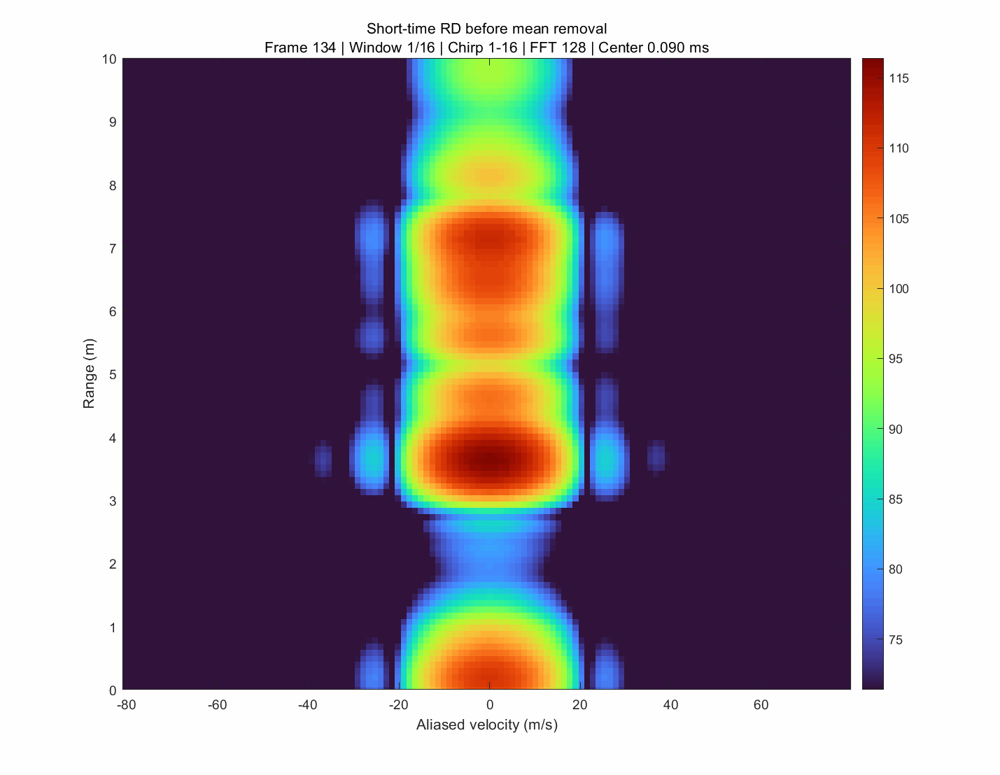
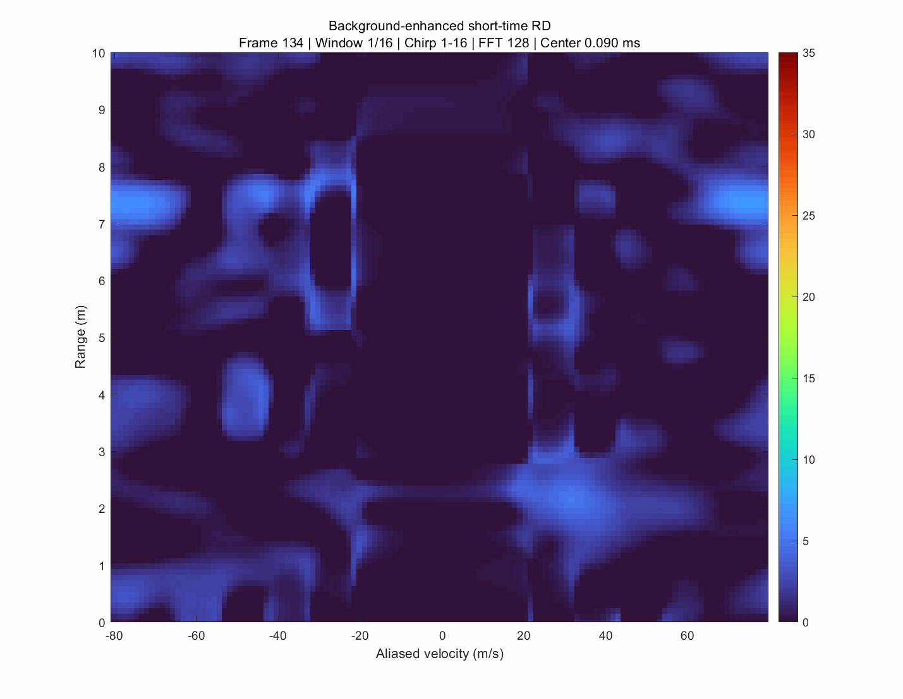

# 高速弹丸毫米波雷达数据分析

> 面向 **AWR2243-2X-CAS-EVM + AM2732R + DCA1000** 实测数据的 MATLAB 高速弹丸毫米波雷达分析工具箱。

本仓库主要用于高速弹丸近距离 FMCW 雷达数据处理，覆盖原始 ADC 解码、短时距离–多普勒处理、背景增强、候选点提取、轨迹关联、速度解模糊以及单帧时频分析等功能。

<p align="center">
  
  
</p>


---

## 项目特点

- 支持 DCA1000 复数 ADC 数据读取与重排
- 支持 1Tx / 8Rx 雷达数据处理
- 逐 Chirp 距离 FFT
- 16-Chirp 短时 Range-Doppler 处理
- 8 路接收通道功率非相干积累
- 发射前 RD 背景中值建模
- 目标 / 背景功率比增强
- 支持两种可切换的 RD 压缩方式：
  - `range`：压缩速度维，保留距离维
  - `velocity`：压缩距离维，保留速度维
- 支持距离域与速度域多候选点提取
- 支持距离–时间轨迹搜索与迭代拟合
- 支持有模糊速度解模糊
- 支持距离–速度耦合误差分析
- 支持多类诊断 GIF 输出
- 支持盲速响应研究
- 支持单物理帧 STFT / FSST 时频分析
- 支持 4 / 8 / 16 / 32 Chirp 数据量对比

---

## 当前处理流程

```text
DCA1000 BIN
    ↓
复数 I/Q 恢复
    ↓
Sample × Chirp × Rx 数据重排
    ↓
Range Hann窗 + Range FFT
    ↓
16 Chirp 短时窗口
    ↓
可选：慢时间去均值
    ↓
Doppler Hann窗 + Doppler FFT
    ↓
8Rx 功率非相干累积
    ↓
短时 RD 数据立方体
    ↓
发射前 RD 背景中值建模
    ↓
目标 / 背景功率比增强
    ↓
┌──────────────────────────────────┐
│ cfg.rdProjectionMode             │
├────────────────┬─────────────────┤
│ "range"        │ "velocity"      │
│ 压缩速度维     │ 压缩距离维      │
│ 保留距离维     │ 保留速度维      │
└───────┬────────┴────────┬────────┘
        ↓                 ↓
  Range-Time图       Velocity-Time图
        ↓                 ↓
   距离候选点          速度候选点
        └─────────┬───────┘
                  ↓
             统一候选表
                  ↓
          距离-时间轨迹选择
                  ↓
             速度解模糊
                  ↓
       指标 / 图像 / CSV / GIF
```

> **当前实现说明：**  
> `velocity` 模式只改变了“候选点产生方式”，后续 `selectTrack()` 仍然使用距离–时间直线轨迹模型。因此当前速度模式更准确地说是：
>
> **速度域候选提取 + 距离域轨迹关联**

---

## 两种 RD 压缩模式

### 1. 距离模式

配置：

```matlab
cfg.rdProjectionMode = "range";
```

对每个短时窗口执行：

$$
E_R(r,w)=\max_v E_{RD}(r,v,w)
$$

即：

```text
二维 RD
    ↓
压缩速度维
    ↓
保留距离维
    ↓
Range-Time 图
    ↓
距离候选点提取
```

同时记录每个距离最大值对应的有模糊速度。

这是目前更成熟的主处理模式。

---

### 2. 速度模式

配置：

```matlab
cfg.rdProjectionMode = "velocity";
```

对每个短时窗口执行：

$$
E_V(v,w)=\max_{r\in\Omega_R}E_{RD}(r,v,w)
$$

即：

```text
二维 RD
    ↓
压缩距离维
    ↓
保留速度维
    ↓
Velocity-Time 图
    ↓
速度候选点提取
```

同时记录每个速度最大值对应的距离。

该模式适合观察：

- 有模糊速度演化
- ±\(V_{\max}\) 回卷
- 速度域候选分布
- 盲速附近响应
- 与 STFT / FSST 时频结果进行对比

---

## 仓库结构

```text
projectile-radar-analysis/
├─ README.md
├─ LICENSE
├─ CITATION.cff
├─ CHANGELOG.md
│
├─ src/+pradar/                   # 核心雷达处理代码
│  ├─ readDca1000Frame.m
│  ├─ processFrameRange.m
│  ├─ buildRdBackground.m
│  ├─ enhancePower.m
│  ├─ compressRdToRangeProfile.m
│  ├─ compressRdToVelocityProfile.m
│  ├─ extractCandidates.m
│  ├─ extractVelocityCandidates.m
│  ├─ selectTrack.m
│  ├─ unwrapTrackVelocity.m
│  ├─ plotResults.m
│  └─ ...
│
├─ configs/                       # 不同数据组配置
│  ├─ config_0725_123207.m
│  ├─ config_0725_135656.m
│  ├─ config_0725_143411.m
│  └─ config_template.m
│
├─ scripts/
│  ├─ run_single_case.m
│  └─ run_all_cases.m
│
├─ +studies/
│  ├─ study_blind_speed_response.m
│  └─ study_single_frame_time_frequency.m
│
├─ examples/
│  └─ demo_candidate_extraction.m
│
├─ docs/
│  ├─ algorithm.md
│  ├─ candidate_extraction.md
│  ├─ track_fitting.md
│  ├─ data_format.md
│  ├─ parameters.md
│  └─ ...
│
├─ data/
│  ├─ README.md
│  └─ 123207_frames_126_135.bin
│
└─ results/
   └─ 0725_123207/
      ├─ *_RD_raw.gif
      ├─ *_RD_mean_removed.gif
      ├─ *_RD_mean_removed_visible.gif
      ├─ *_RD_enhanced.gif
      ├─ *_candidates.csv
      └─ *_track.csv
```

---

## 快速开始

### 1. 克隆仓库

```bash
git clone https://github.com/ZHANGCQ2001/projectile-radar-analysis.git
cd projectile-radar-analysis
```

### 2. 初始化 MATLAB 路径

在仓库根目录执行：

```matlab
startup
```

### 3. 运行单组数据

打开：

```text
scripts/run_single_case.m
```

设置数据组：

```matlab
caseId = "0725_123207";
```

如果：

```matlab
dataFile = "";
```

则运行时会弹出 BIN 文件选择框。

执行：

```matlab
run("scripts/run_single_case.m")
```

### 4. 切换 RD 压缩模式

在对应配置文件中修改：

```matlab
cfg.rdProjectionMode = "range";
```

或：

```matlab
cfg.rdProjectionMode = "velocity";
```

### 5. 批量运行

```matlab
run("scripts/run_all_cases.m")
```

---

## 已配置数据组

| 数据组        |       实测速度 | 主要用途               |
| ------------- | -------------: | ---------------------- |
| `0725_123207` |  428.62203 m/s | 主要开发与调试数据     |
| `0725_135656` |  432.09819 m/s | 独立外场数据验证       |
| `0725_143411` | 1207.82892 m/s | 高速模糊与短时处理研究 |

---

## 默认雷达参数

| 参数                |         数值 |
| ------------------- | -----------: |
| 起始 / 中心频率     |       77 GHz |
| 每 Chirp ADC 采样点 |           64 |
| 每物理帧 Chirp 数   |          256 |
| 接收通道数          |            8 |
| 发射通道数          |            1 |
| ADC 采样率          |       10 MHz |
| 调频斜率            | 60.01 MHz/μs |
| Chirp 周期          |        12 μs |
| 物理帧周期          |       3.5 ms |
| Range FFT 点数      |          256 |
| 短时窗口长度        |     16 Chirp |
| Doppler FFT 点数    |          128 |

各数据组的：

- 背景帧范围
- 目标帧范围
- 距离门限
- 速度门限
- 轨迹参数
- 解模糊参数

由 `configs/` 中对应配置文件决定。

---

## 背景增强

程序首先对发射前多个 RD 窗口进行中值统计：

```matlab
backgroundPower = median(rdPowerCube, 3, 'omitnan');
```

然后计算：

$$
E_{RD}
=
10\log_{10}
\frac{P_{\mathrm{target}}+\epsilon}
     {P_{\mathrm{background}}+\epsilon}
$$

因此当前程序中的：

```text
RD enhancement
```

表示的是：

$$
\boxed{\text{目标功率 / 背景功率}}
$$

对应的增强量，而不是严格意义上的热噪声 SNR。

---

## 慢时间去均值与盲速

可通过：

```matlab
cfg.slowTimeMeanRemoval = true;
```

启用慢时间去均值：

$$
x[n]\leftarrow x[n]-\bar{x}
$$

其作用是抑制零 Doppler 静态杂波，但同时也会在以下径向速度处产生周期性速度零陷：

$$
v_{b,m}=m\frac{\lambda}{2T_c}
$$

对于当前 77 GHz、12 μs Chirp 周期配置：

$$
\frac{\lambda}{2T_c}\approx161.9\ \mathrm{m/s}
$$

因此理论盲速包括：

$$
0,\ \pm161.9,\ \pm323.9,\ \pm485.8,\dots
$$

对应研究脚本：

```matlab
studies.study_blind_speed_response
```

该脚本用于分析：

- 理论去均值响应
- 数值仿真响应
- 实际 RD 峰值衰减响应
- 盲速附近速度偏移与衰减关系

---

## 单物理帧时频分析

高速弹丸在一个物理帧内部已经可能存在明显的非平稳 Doppler 变化。

因此仓库中提供：

```matlab
studies.study_single_frame_time_frequency
```

用于进行：

- Chirp 级 Range FFT
- 弹丸距离轨迹提取
- STFT
- FSST
- 4 / 8 / 16 / 32 Chirp 窗口对比

主要用于研究：

> 在尽可能减少重复周期数量的条件下，是否仍然可以可靠提取高速目标的单帧 Doppler 演化。

---

## 输出结果

每组数据可输出：

```text
*_candidates.csv
*_track.csv

*_RD_raw.gif
*_RD_mean_removed.gif
*_RD_mean_removed_visible.gif
*_RD_enhanced.gif
```

### GIF 含义

| 文件                      | 含义                                   |
| ------------------------- | -------------------------------------- |
| `RD_raw`                  | 慢时间去均值前的短时 RD                |
| `RD_mean_removed`         | 去均值后的 RD，与 Raw 共用绝对功率色标 |
| `RD_mean_removed_visible` | 去均值后的 RD，自适应显示色标          |
| `RD_enhanced`             | 背景增强后的目标 / 背景功率比 RD       |

其中：

```text
RD_raw
vs
RD_mean_removed
```

可以直接比较静态杂波被压低了多少。

而：

```text
RD_mean_removed_visible
```

主要用于观察去均值后剩余的动态结构。

---

## 仓库内测试数据

当前仓库包含一段裁剪数据：

```text
data/123207_frames_126_135.bin
```

该文件包含 `0725_123207` 实验中的 10 个连续物理帧，用于：

- 算法调试
- RD 可视化
- 单帧时频分析
- 回归验证

完整外场原始数据未上传。

`.gitignore` 默认忽略大型原始数据和 MAT 文件，但允许：

```text
results/**/*.csv
results/**/*.gif
```

这类轻量结果文件被提交到仓库。

---

## MATLAB 依赖

核心处理主要使用 MATLAB 常规功能：

- FFT
- 数组运算
- table
- figure / imagesc
- GIF 导出

单帧 FSST 研究根据 MATLAB 版本可能需要 Signal Processing Toolbox。

---

## 测试与示例

运行测试：

```matlab
run("tests/run_tests.m")
```

运行候选点示例：

```matlab
run("examples/demo_candidate_extraction.m")
```

该示例不依赖完整外场 BIN 数据。

---

## 详细文档

- [`docs/algorithm.md`](docs/algorithm.md)
- [`docs/candidate_extraction.md`](docs/candidate_extraction.md)
- [`docs/track_fitting.md`](docs/track_fitting.md)
- [`docs/data_format.md`](docs/data_format.md)
- [`docs/parameters.md`](docs/parameters.md)

---

## 当前局限

当前仓库定位为高速弹丸毫米波雷达算法研究与实验分析平台，并非最终生产级跟踪系统。

目前主要限制包括：

- Velocity 模式仅完成速度域候选提取，后续仍采用距离–时间轨迹模型
- RD enhancement 不能直接作为严格 SNR
- 绝对 RCS 估计需要系统标定
- 高速近距离目标存在距离–速度耦合
- 弹丸、弹托、烟尘及动态环境杂波可能同时存在
- Doppler 轴具有周期性，±\(V_{\max}\) 附近必须使用圆周速度距离
- 慢时间去均值可能引入周期性盲速零陷
- 目标高速运动时，单帧内部可能已经不满足恒定 Doppler 假设

---

## 后续计划

- 实现真正独立的速度域轨迹关联算法
- 增加单帧目标 SNR 定量估计
- 增加经标定的 RCS 反演
- 完善距离–速度耦合补偿
- 对比 Short-time RD、STFT、FSST 在相同数据量下的性能
- 研究弹丸 / 弹托 / 烟尘多散射体分离
- 增加更多实测数据与自动化回归测试

---

## 引用

引用信息见：

```text
CITATION.cff
```

---

## 许可证

本项目采用 MIT License。

如用于公开发布，请提前确认：

- 实验数据
- 雷达参数
- 算法细节
- 项目成果
- 专利与论文内容

符合对应的公开与知识产权要求。
